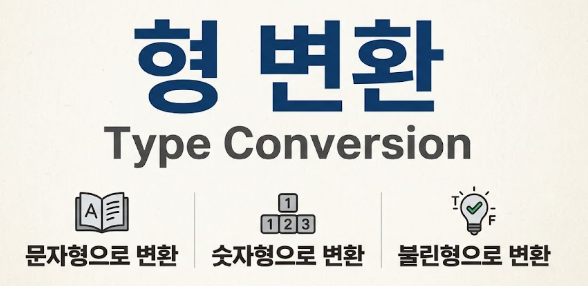

## 형 변환 (Type Conversion)


함수와 연산자에 전달되는 값은 대부분 적절한 자료형으로 자동 변환된다. 이러한 과정을 형 변환(Type Conversion)이라고 한다.

형 변환은 크게 두 가지로 나뉜다.

* **암시적 형 변환 (Implicit Conversion):** 자바스크립트 엔진이 필요에 따라 자동으로 수행하는 변환
* **명시적 형 변환 (Explicit Conversion):** 개발자가 의도적으로 함수 등을 활용해 변환하는 방식

`alert` 메서드가 전달받은 값의 자료형과 관계없이 이를 문자열로 자동 변환하여 보여주는 것이나, 수학 관련 연산자가 전달받은 값을 숫자로 변환하는 경우가 대표적인 형 변환의 예시이다.

---

### 1. 문자형으로 변환

**문자형으로의 형 변환**은 문자형의 값이 필요할 때 일어난다.

`alert` 메서드는 매개변수로 문자형을 받기 때문에, `alert(value)`를 실행할 때 `value`는 자동으로 문자형으로 변환된다.

또한, `String(value)` 함수를 명시적으로 호출하여 전달받은 값을 **문자열로 변환**할 수도 있다.

```javascript
let value = true;
alert(typeof value); // boolean

value = String(value); // 변수 value엔 문자열 "true"가 저장된다.
alert(typeof value); // string

```

### 🔍 쉬운설명

💡 **문자형 변환은 '텍스트 라벨 붙이기'와 같다!**
숫자 `123`이나 참/거짓을 뜻하는 `true`라는 데이터에 "이건 그냥 화면에 출력할 글자야"라고 알리는 **텍스트 스티커**를 붙이는 것과 같다. 숫자로 연산하는 것이 아니라 단순히 '보여주는 용도'로 바꿀 때 문자형 변환이 일어난다.

---

### 2. 숫자형으로 변환

**숫자형으로의 변환**은 수학과 관련된 함수와 표현식에서 자동으로 일어난다.

숫자형이 아닌 값에 나눗셈 연산자 `/`를 적용한 경우처럼, 산술 연산을 만나면 자바스크립트는 내부적으로 문자를 숫자로 바꾸어 처리한다.

```javascript
alert("6" / "2"); // 3, 문자열이 숫자형으로 자동변환된 후 연산이 수행된다.

```

`Number(value)` 함수를 사용하면 주어진 `value`를 숫자형으로 **명시적 형 변환**할 수 있다.

```javascript
let str = "123";
alert(typeof str); // string

let num = Number(str); // 문자열 "123"이 숫자 123으로 변환된다.
alert(typeof num); // number

```

웹 페이지의 입력 폼(Form)을 통해 사용자에게 입력받는 데이터는 기본적으로 **문자열 형태**이다. 따라서 입력받은 값으로 수학적 계산을 수행하려면 `Number()`를 통한 명시적 형 변환이 필수적이다.

한편, 숫자 이외의 글자가 들어가 있는 문자열을 숫자형으로 변환하려고 하면, 변환에 실패하여 결과는 `NaN` (**Not a Number**)이 된다.

```javascript
let age = Number("임의의 문자열 123");
alert(age); // NaN, 형 변환 실패

```

#### 숫자형 변환 규칙 예시

```javascript
alert( Number("   123   ") ); // 123 (공백은 자동으로 제거됨)
alert( Number("123z") );      // NaN ("z"를 숫자로 변환하는 데 실패함)
alert( Number(true) );        // 1
alert( Number(false) );       // 0

```

### 🔍 쉬운설명

💡 **숫자형 변환은 '계산기 입력기'와 같다!**
계산기에 글자 "백이십삼"을 넣으면 계산기가 작동하지 않는 것처럼, 컴퓨터도 산술 연산을 하려면 데이터가 완벽한 **숫자 형태**여야 한다. `Number()`는 입력받은 텍스트에서 공백을 털어내고 순수한 숫자로 바꿔주는 역할을 한다. 이때 숫자 외의 알파벳이나 특수문자("123z")가 섞여있으면 계산기가 에러 메시지인 `NaN` (숫자가 아님)을 내뱉는다.

---

### 3. 불린형으로 변환

**불린형(Boolean)으로의 변환**은 논리 연산을 수행할 때 발생한다.

`Boolean(value)` 함수를 호출하면 명시적으로 참(`true`) / 거짓(`false`)으로의 형 변환을 수행할 수 있다.

#### 불린형 변환 규칙

* **`false`로 변환되는 값:** 숫자 `0`, 빈 문자열 `""`, `null`, `undefined`, `NaN`과 같이 직관적으로 "비어있다"고 느껴지는 값
* **`true`로 변환되는 값:** 위의 값들을 제외한 모든 값 (숫자 `1`, 문자열 `"0"`, `"hello"` 등)

```javascript
alert( Boolean(1) ); // 숫자 1(true)
alert( Boolean(0) ); // 숫자 0(false)

alert( Boolean("hello") ); // 내용이 있는 문자열(true)
alert( Boolean("") );      // 빈 문자열(false)

```

### 🔍 쉬운설명

💡 **불린형 변환은 '상자 확인하기'와 같다!**
상자 안에 무엇이든 들어있으면 **`true` (있음)**, 상자가 완전히 비어있거나(`0`, `""`, `null`, `undefined`) 파손된 상태(`NaN`)면 `false` (없음)로 판단하는 규칙이다.

---

### 4. 자바스크립트 주요 형 변환 요약

| 변환 전 자료형 | 변환 함수 / 상황 | 변환 후 결과 | 주요 특징 및 주의사항 |
| --- | --- | --- | --- |
| **모든 타입** | `String(value)` | `"value"` | 데이터 형태 그대로 문자열화 |
| **문자열 `"123"**` | `Number(value)` | `123` | 앞뒤 공백은 제거 후 숫자로 변환 |
| **문자열 `"123z"**` | `Number(value)` | `NaN` | 숫자가 아닌 문자가 포함되면 실패 |
| **`true` / `false**` | `Number(value)` | `1` / `0` | 불리언 값의 숫자 변환 |
| **`0`, `""`, `null`, `undefined`, `NaN**` | `Boolean(value)` | `false` | 비어있는 개념의 값들은 거짓 처리 |
| **그 외 모든 값** | `Boolean(value)` | `true` | 값이 존재하면 참 처리 |

#### 형 변환 메커니즘 구조도

```text
[ 입력 데이터 ]
      │
      ├─────── 명시적 변환 ───────► String() / Number() / Boolean() 사용
      │
      └─────── 암시적 변환
                  │
                  ├─ alert(value) ────────► 문자형(String)으로 자동 변환
                  ├─ 연산자 "6" / "2" ────► 숫자형(Number)으로 자동 변환
                  └─ 조건문 if(value) ────► 불린형(Boolean)으로 자동 변환

```