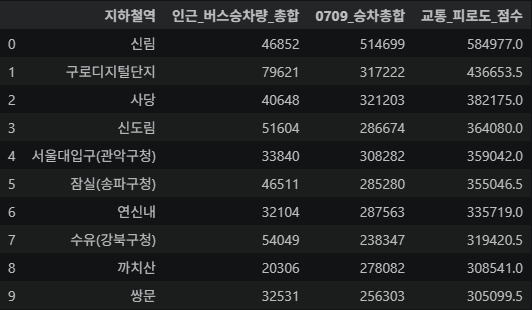
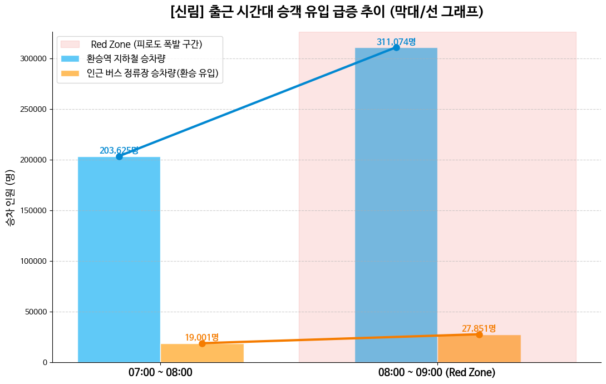
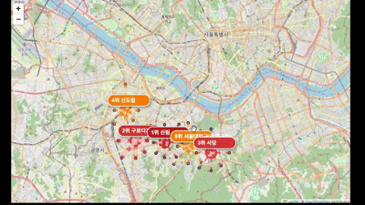
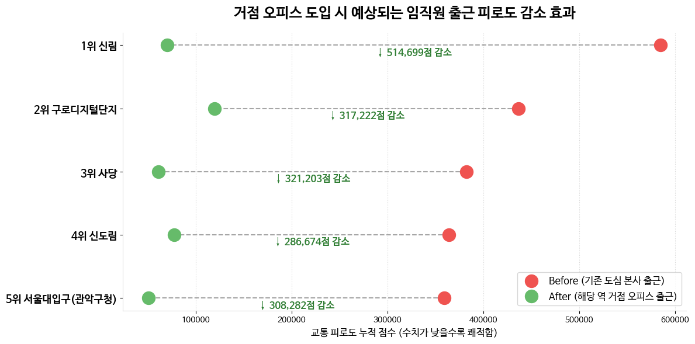
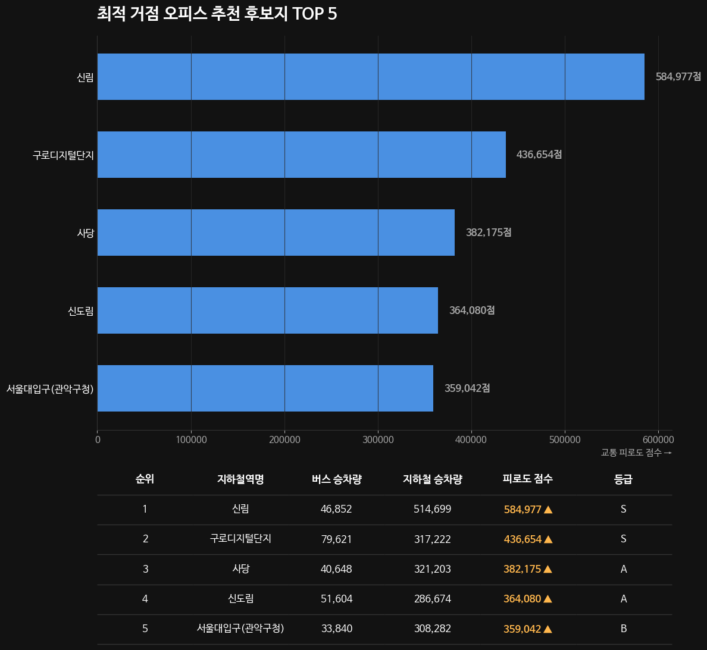

# 🚇 TFI 스마트워크플레이스 입지최적화

> **Transit Fatigue Index** 기반 거점 오피스 최적 입지 선정 및 출근길 병목 해소 전략

<br>

---

## 📌 프로젝트 소개

기존 거점 오피스는 **강남·여의도 등 도심 핫플레이스** 중심으로 운영되어 왔습니다.
하지만 실제로 가장 극심한 출근 피로를 겪는 임직원은 따로 있습니다.

```
🏠 집(마을버스) ──→ 🚉 외곽 환승역(지하철) ──→ 🏢 도심 본사
```

본 프로젝트는 **공공데이터(지하철·버스 시간대별 승하차 데이터)** 와 **카카오 지도 API**를 결합하여,
다중 환승 고통이 집중되는 **진짜 병목 구간**을 데이터로 증명하고,
이를 선제적으로 차단할 **최적의 거점 오피스 입지**를 제안합니다.


## 🗂️ 스토리 구조 (SCQA 프레임워크)

| 구분 | 내용 |
|---|---|
| **S** Situation | 기업들은 워라밸·출퇴근 시간 단축을 위해 거점 오피스를 확대하고 있다 |
| **C** Complication | 그러나 현재 거점 오피스는 강남·여의도 도심에 편중되어, 외곽 거주자의 다중 환승 고통은 방치되어 있다 |
| **Q** Question | 공공데이터로 가장 극심한 환승 병목 구간을 찾아내고, 최적 거점 오피스 위치를 증명할 수 있을까? |
| **A** Answer | TFI 분석 결과, **신림·구로디지털단지 등 외곽 환승 허브**가 최적 입지로 도출되었다 |

<br>

---

## 🎯 핵심 지표 — Transit Fatigue Index (TFI)

본 프로젝트의 핵심 KPI는 **교통 피로도 점수(Transit Fatigue Index)** 입니다.

$$TFI = (\text{인근 버스 승차량 합계} \times 1.5) + \text{지하철 출근시간대 승차량}$$

| 구성 요소 | 설명 | 가중치 |
|---|---|---|
| 🚌 버스 승차량 | 해당 역 인근 버스 정류장 승차 총합 | **×1.5** (환승 페널티) |
| 🚇 지하철 승차량 | 출근 피크타임(07~09시) 자체 승차량 | ×1.0 |

> **가중치 근거**: 버스 환승객은 `대기 → 탑승 → 하차 → 환승 이동`이라는 추가적인 신체·정신적 소모를 겪으므로, 도보 이용객 대비 1.5배 페널티를 도메인 지식 기반으로 부여

<br>

---

## 📂 데이터 소스

총 **3개의 CSV 파일**을 사용합니다.

```
📁 data/
├── subway_data.csv         # 공공데이터 포털 — 지하철 시간대별 승하차 인원
├── bus_data.csv            # 공공데이터 포털 — 버스 노선별 정류장 승하차 인원
└── kakao_map_data.csv      # 카카오 지도 API — 지하철역 위치 좌표 (위도/경도)
```

| 파일 | 출처 | 주요 컬럼 |
|---|---|---|
| `subway_data.csv` | 공공데이터포털 | 역명, 호선, 시간대, 승차인원, 하차인원 |
| `bus_data.csv` | 공공데이터포털 | 정류장명, 노선번호, 시간대, 승차인원 |
| `kakao_map_data.csv` | 카카오 지도 API | 역명, 위도(lat), 경도(lng) |

<br>

---

## 🔬 분석 파이프라인

```
① 데이터 수집          ② 시간 필터링         ③ 공간 결합
공공데이터 3종 로드  →  07~09시 피크타임 슬라이싱  →  역명 정규화 후 버스↔지하철 매핑
                                                          ↓
⑤ 시각화 & 인사이트       ④ TFI 산출
상위 5개 후보지 검증   ←  버스 ×1.5 + 지하철 합산
```

### Step 1 · 데이터 수집
- 공공데이터포털에서 지하철 승하차, 버스 정류장 승하차 데이터 수집
- 카카오 지도 API로 역별 정확한 위·경도 좌표 확보

### Step 2 · 시간 필터링
- 분석 기간: 최근 1개월
- 피크타임: **07:00 ~ 09:00** 출근 집중 시간대만 슬라이싱

### Step 3 · 공간 결합 (텍스트 기반 매핑)
- 지하철 역명 정규화 → 괄호, `'역'` 제거 후 키워드 매칭
- 해당 역명 포함 인근 버스 정류장 승차 데이터 그루핑

### Step 4 · TFI 산출
- 버스 유입량에 환승 페널티 **1.5배** 적용
- 지하철 자체 탑승객과 합산 → 역별 TFI 도출

### Step 5 · 시각화 및 검증
- 상위 5개 후보 입지에 대한 정량·정성적 타당성 검증

<br>

---

## 📊 핵심 시각화

| 시각화 | 유형 | 인사이트 |
|---|---|---|
| 🗺️ 핏줄 지도 | Folium Hub & Spoke Map | 외곽 환승역의 마을버스 유입 병목 공간적 증명 |
| 📈 Red-Zone 시계열 | Matplotlib 시계열 차트 | 08시를 기점으로 한 '피로도 폭발 시간대' 확인 |
| 🥊 덤벨 차트 | Before & After Dumbbell | 거점 오피스 도입 시 피로도 50% 이상 감소 효과 |
| 🏆 다크 대시보드 | 가로 막대 + Table Grid | 경영진 보고용 최종 순위 요약 |
| 📍 카카오 지도 | 카카오맵 API 마커 | 후보 입지의 실제 지리적 위치 시각화 |

### 시각화 설계 원칙

- **비례의 원칙**: 지도 마커 반경을 TFI 실제 값에 비례하여 설정 (시각적 왜곡 방지)
- **Data-Ink 최적화**: 불필요한 테두리·그리드 제거, 핵심 데이터에 시선 집중
- **색상으로 의미 전달**: 🔴 위험 구간 Red `#ef5350` / 🟢 개선 효과 Green `#66bb6a`
- **직접 라벨링**: 범례 없이 그래프 내부에 수치·텍스트 직접 배치

---


---



---



---



---




<br>

---

## 💡 핵심 인사이트 (Pyramid Principle)

```
👑 CORE MESSAGE
거점 오피스는 강남(도심)이 아닌
'신림', '구로디지털단지' 등 외곽 환승 허브에 구축해야 한다.
        │
        ├── 💡 공간 증명
        │   외곽 환승역은 마을버스 유입으로 인한 거대한 물리적 병목이 발생한다.
        │   → Hub & Spoke 핏줄 지도로 증명
        │
        ├── 💡 시간 증명
        │   08시를 기점으로 버스·지하철 탑승객이 동시에 폭증하는
        │   '피로도 폭발 시간대'가 뚜렷하게 존재한다.
        │   → Red-Zone 시계열 차트로 증명
        │
        └── 💡 효과 입증
            병목 구간에 거점 오피스 도입 시
            임직원 출근 피로도를 최소 50% 이상 감소시킬 수 있다.
            → Before & After 덤벨 차트로 증명
```

<br>

---

## 📐 기초 통계 분석 4대 요소

| 통계 개념 | 발견 내용 |
|---|---|
| **집중경향성** | 하차 중심값은 강남·역삼에 집중 / **승차·버스 환승 중심값은 2호선 외곽(신림·사당)에 집중** |
| **분산·변동성** | 07시→08시 구간에서 승객 유입이 **이상치(Outlier) 수준**으로 급등 |
| **상관관계** | 지하철 자체 승차량 ↔ 인근 버스 정류장 승차량 간 **강한 양(+)의 상관관계** 확인 |
| **비율·가중치** | 버스 환승 추가 소모(대기·환승 이동)를 반영한 **1.5배 도메인 가중치** 적용 |

<br>


## 🛠️ 사용 기술


<br>

---

<div align="center">
  <sub>📊 데이터 출처: 공공데이터포털 | 🗺️ 지도 API: 카카오 지도</sub><br>
  <sub>Made with ❤️ by 오정호</sub>
</div>