# 이어드림스쿨 오리엔테이션 후기

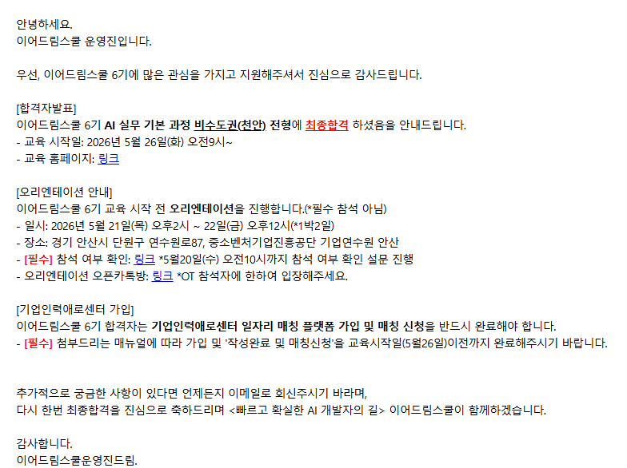

안녕하세요 저번 이어드림스쿨 합격 후기 및 지원동기 글에 이어서 이번에는 오리앤테이션 후기를 가져왔습니다.

위에 사진처럼 오리앤테이션은 1박2일동안 연수원? 같은곳에서 진행되더라구요

저는 이번에 6기지만 지난 기수들도 오리앤테이션은 1박2일로 진행했던걸로 알고 있어요 

처음에는 갈까 말까 고민했지만 가서 인사이트도 얻고 앞으로의 학습 방향성이나 마음가짐을 다짐할겸 가는게 맞다고 생각해서 신청했다.

## 오리엔테이션 일정표
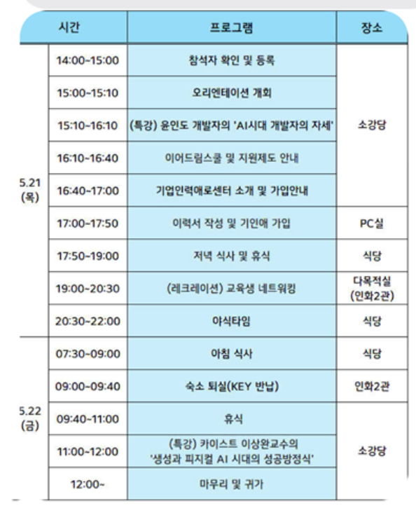

오리앤테이션 진행 일정은 다음과 같다.

셔틀버스를 운영해서 12시까지 서울역에 도착해서 연수원에 도착했다.

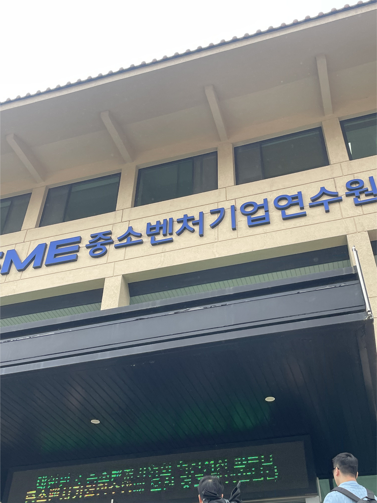

도착하고 안내 데스크에서 접수를 하고 웰컴 키트를 받았다.

---
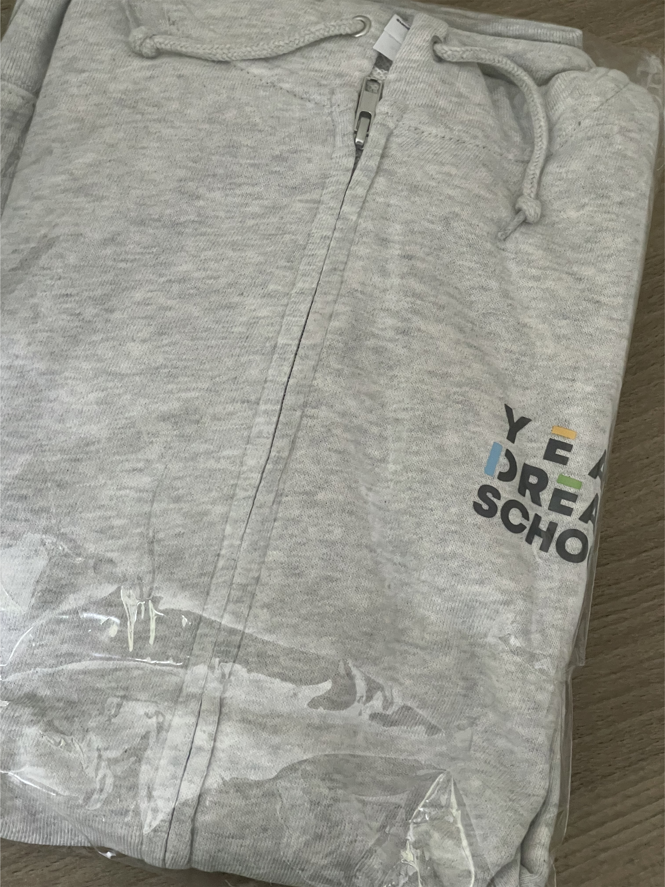
이어드림스쿨 OT 진행할때 입는 후드티를 제공해주셨다. 5월이라 조금 덥긴했지만 에어컨을 파워냉방으로 틀어주셔서 후드티를 입으면 딱 좋았다.

---
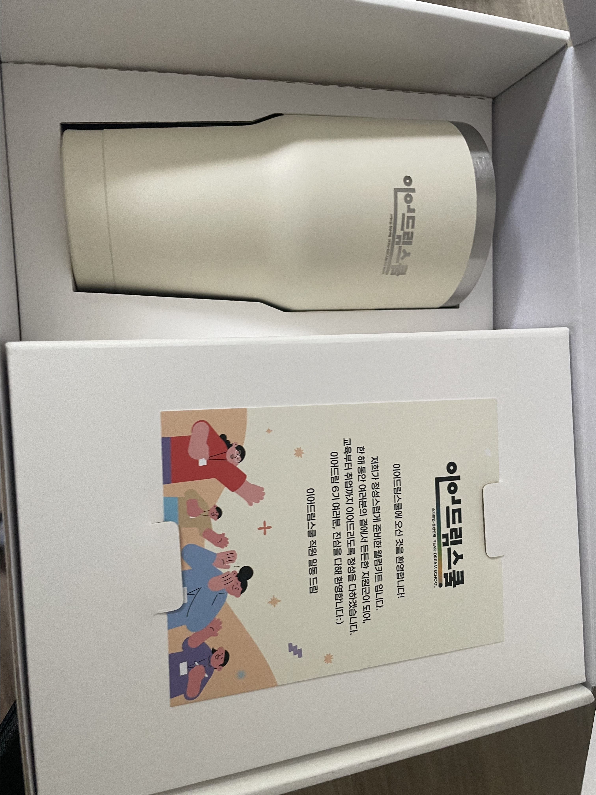
처음엔 심플한 텀블러가 보였고 오른쪽엔 내용물이 담겨있을만한 실루엣이라 기대가 되었다.

---
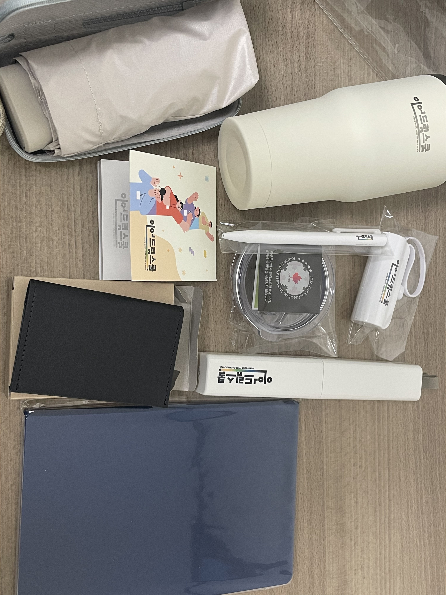
왼쪽 위에 선글라스 케이스처럼 보이는건 다름 아닌 우산이다!! 엄청 귀여움 가방에 넣고 다니니 편리할듯

그외에도 보조배터리, 카드지갑, 노트, 칫솔세트, 보조배터리, 볼펜, 메모지 등 웰컴키트의 정석들이였다. 안그래도 보조배터리 없었는데 받아서 좋았다.

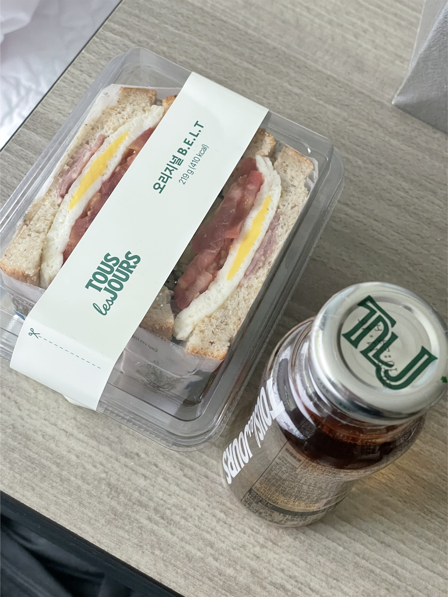

도착시간이 14:00 였던걸로 기억하는데 배가 허기진 상태였는데 샌드위치랑 음료수를 제공해줘서 좋았다. 그리고 연수원 안에 매점이 있는데 수강생들은 장부에 이름을 적고 이용하면 비용은 이어드림스쿨쪽에서 부담하는 시스템 같았다.

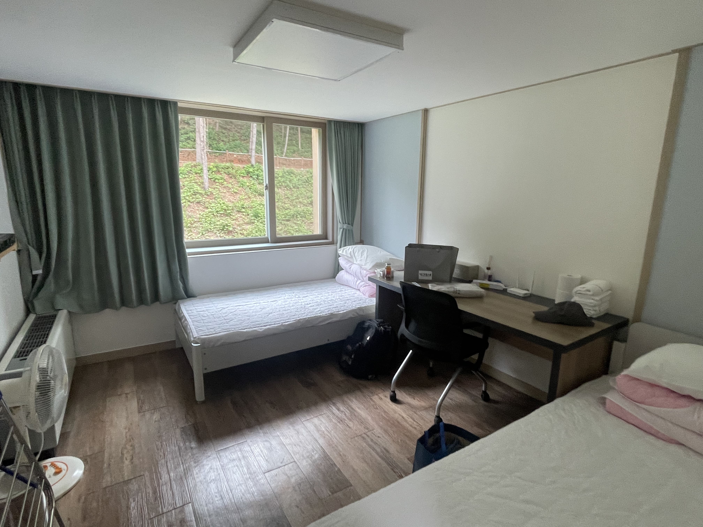

여기는 이제 1박2일동안 지낼 나의 방이다 룸메는 이미 도착하고 짐을 풀고 어디로 나간거같아서 아쉽게도 인사를 하지 못했다.

## 이어드림스쿨 OT 개회식
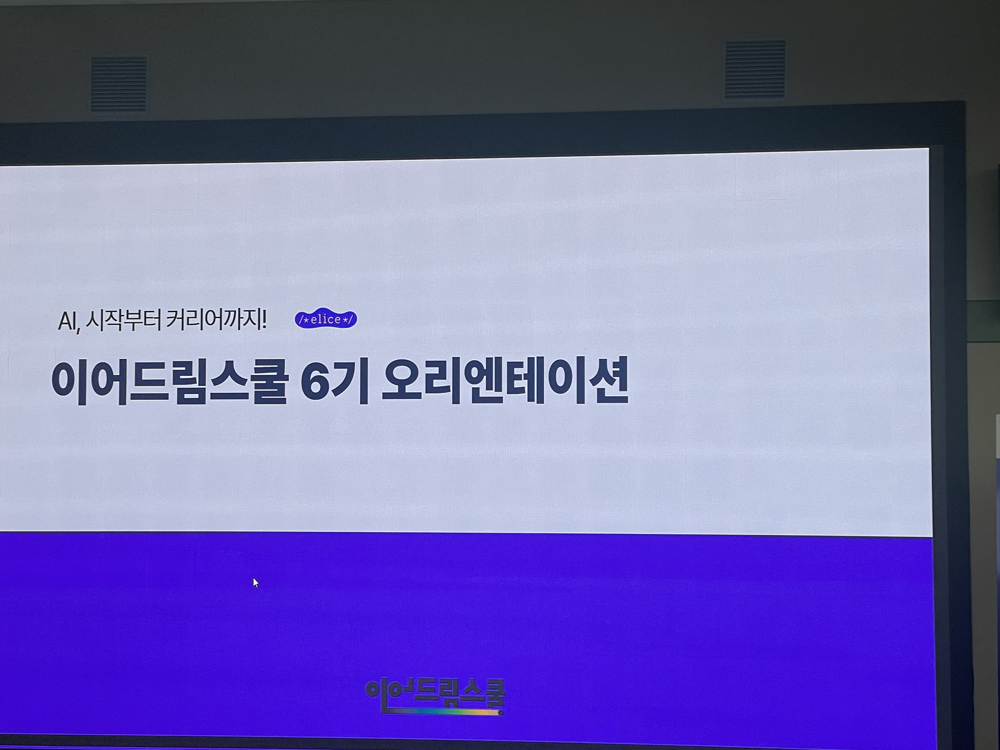

오리엔테이션은 넓은 소강당에서 진행되었다. 간단히 OT 소개와 이어드림스쿨 6기 프로그램 구성, 수업 진행방식, 커리큘럼 등 안내를 해주셨다.

## 교육생 혜택 및 우수자 포상
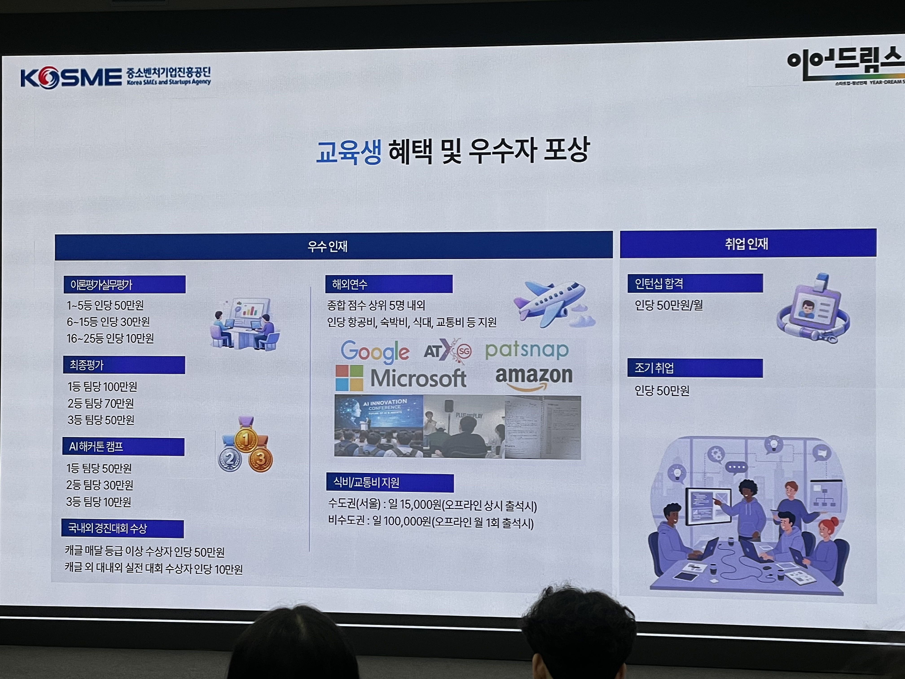

한달에 한번 코딩테스트가 있고, 교육기간 동안 중간에 해커톤 캠프, 대외활동, 최종 평가 등에서 우수한 성적을 받으면 장학금을 지급해준다.

또한 종합 점수 상위 TOP5명 안에 들면 해외연수도 보내준다...!!

한달에 한번 오프라인 교육이 있는데 필수가 아니라 선택이다.

오프라인 지점은 전국적으로 총 5곳인가 4곳이 있는데 오프라인 수업 참여시 
일 100,000원을 지급해준다.

## 'AI시대 개발자의 자세 특강"
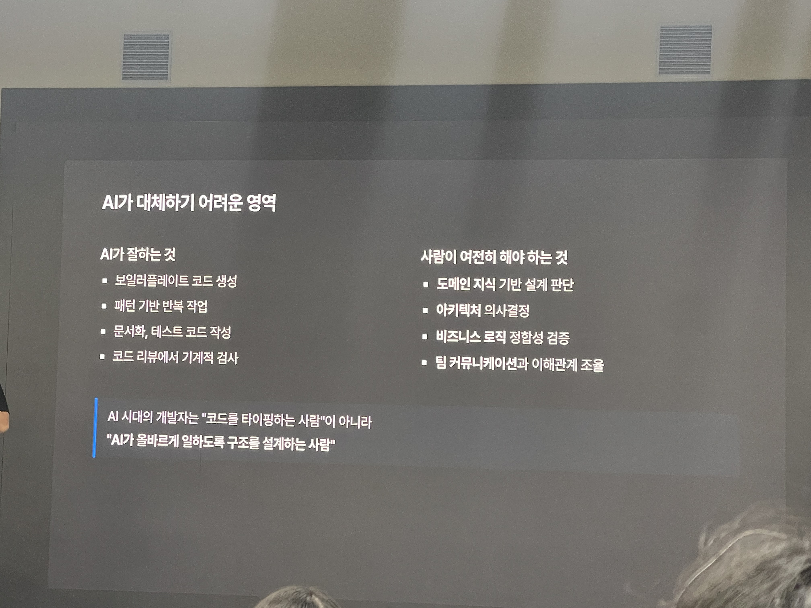

윤인도 개발자님의 'AI 시대 개발자의 자세' 특강이다. 해외에서 개발자로 일하고 계시다고 들었고, 'AI'가 필수인 요즘 시대에 개발자가 가져야할 마인드셋과 필수 능력들을 말씀해주셨다.

그 중에 인상깊은거 중에 첫 번째는 

'AI'가 대체하기 어려운 영역에서의 사람이 여전히 해야 하는 것 + 잘 해야 하는것이다.

나의 생각은 이렇다

아직은 'AI'가 모든 일자리를 대체할 순 없다. 결국 이 세상은 시스템이고 이 시스템은 사람이 만들고 사람이 있어야 시스템이 돌아간다.

단순히 '코더'만 잘하는 개발자는 대체당하지만, 회사 내에서의 협업 커뮤니케이션 능력이라든지 'AI'가 할 수 없는 부분은 사람이 여전히 해야한다.

나는 그 능력이 출중하다고 생각한다. 이제까지 살면서 남이 나를 평가했을때 내가 나를 평가했을때 어떤 포지션이나 상황이든 긍정적인 평가를 받았다.

두 번째는

기술 블로그 + 메모장이다.

---
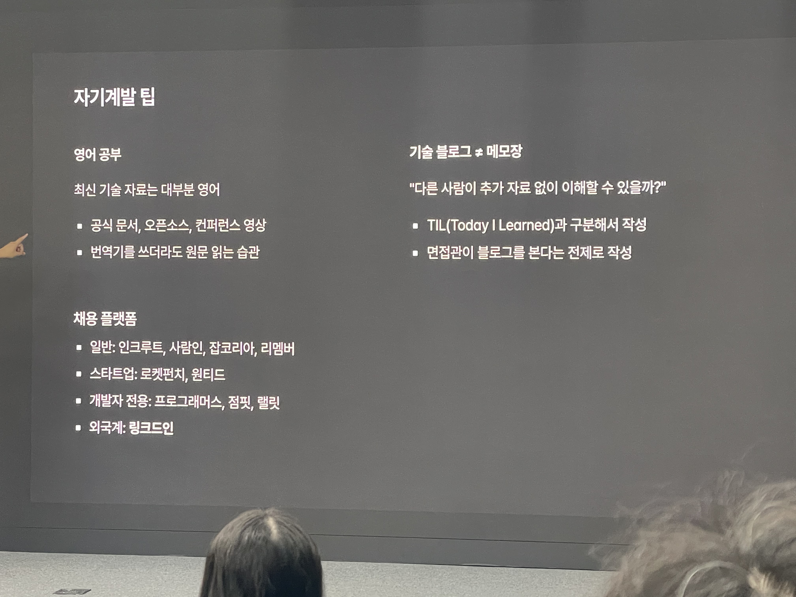

강사님은 이런 말씀을 하셨다. 블로그 쓰는거 좋다 자기 PR의 시대이기도 하고 기록을 남기면 나의 가치를 남이 알 수 있다는거니까

개발자 취준생 입장에서 블로그를 쓸때 주의점을 말씀하셨다.

블로그를 쓸때 이 글의 독자의 관점을 누구로 할지에 따라 작성이 완전 달라진다고 하셨다.

일상 블로그나 스스로 학습한 내용을 정리한 블로그는 블로그의 글체가 가볍게 느껴진다. 어떻게 보면 누군가를 위한 글이 아니라 내가 스스로 작성하고 내가 읽는 것 처럼 작성하다보니까 그런거다

하지만, 개발자 취준생은 기술 블로그를 작성한다면, 면접관 입장에서 생각도 해보고 누군가가 이 글을 보았을때 다른 자료를 추가로 찾아볼 필요 없이도 이해가 되는가? 에 대한 관점에서 바라보고 작성을 했으면 좋겠다라고 하셨다.

듣고 난 내가 작성한 블로그들은 어떻게 어떤 관점에 따라 작성을 했는지 생각을 해보았다.

난 강사님께서 말씀하신대로 블로그를 작성한것같아서 만족한다.

동작 코드와, 코드 설명을 비유로 작성하기도 하고, 글을 쓸때 나는 코딩을 가르치는 강사라는 생각으로 작성하기도 한다.

## 교육생 네트워킹 (레크레이션)

사진 찍는걸 깜빡했다.... 강당같은곳에서 교육생들이 모여서 팀을 이루고 레크레이션 강사님이 프로그램을 진행하신다.

다양한 게임을 즐기고 교육생들끼리 얼굴도 조금 익히고 말문을 트는 시간이였다.

레크레이션이 끝나고 식당으로 가서 야식타임을 즐겼다

난 이때 다이어트중이라 한입도 안먹고 숙소로 돌아가서 쉬었다..... ㅠㅠㅠㅠ 
